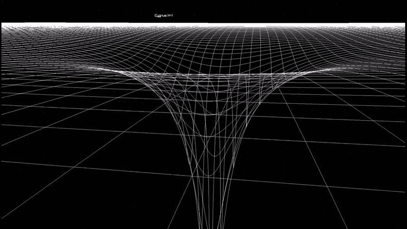

# Gravity Well

C++17 N-body gravity simulator rendered with raylib. Simulates orbital mechanics between objects (stars, planets, black holes) with mutual gravitational attraction, orbit trails, and a visual spacetime grid that warps under mass.



## Requirements

- C++17 compiler (`clang++`)
- raylib (`brew install raylib` on macOS)
- `pkg-config`

## Build

```sh
make
```

## Run

```sh
make run
# or
./gravity_well
```

Starts in fullscreen with the solar system preset loaded. To try a different scenario (`solar_system`, `alpha_centauri_system`, `SagittariusA`, `CygnusX1`), swap the call in `main.cpp:37` and rebuild.

## Controls

- Click to capture the mouse and look around, click again to release it
- `W`/`A`/`S`/`D`: move forward/left/back/right
- `Space` / `Left Ctrl`: move up/down
- Mouse wheel: adjust camera movement speed

## Structure

```
src/
├── main.cpp                        # window init, main loop
├── object.h / object.cpp           # simulated body: position, velocity, mass, color
├── engine.h / engine.cpp           # gravity integration step
├── initial_conditions.h / .cpp     # starting scenarios (solar system, Alpha Centauri, Sagittarius A*, Cygnus X-1)
├── camera.h / camera.cpp           # free-fly camera movement and zoom
├── renderer.h / renderer.cpp       # draws bodies, labels, and the starfield
├── orbit_trail.h / orbit_trail.cpp # trailing path drawn behind each object
└── spacetime.h / spacetime.cpp     # spacetime grid deformed by nearby mass
```
